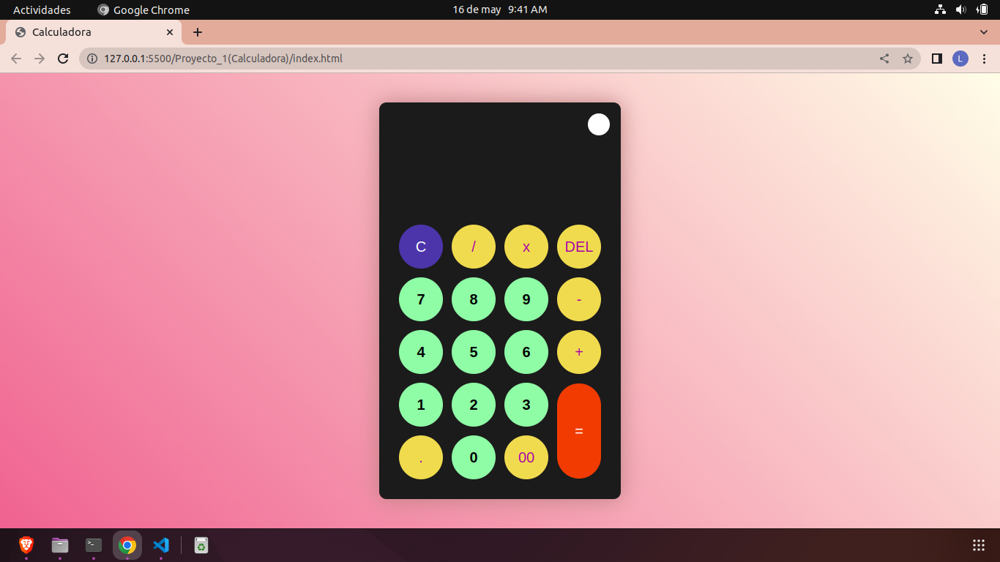

# Calculadora

Es un sitio web donde aprendemos a crear  una calculadora personalizada donde podemos cambiar el tema de esta misma gracias a la ayuda de JS.

En el index.html creamos un una tabla en el body que hace la forma de la calculadora sin ningun tipo de decoracion ni funcionamiento solo los id y las clases que vamos a utilizar para darle su propia funcionamiento ya en js nos permite añadir procedimientos atravez de parametros y funciones que puede hacer nuestra calculadora al ser presionado un caracter lo muestre en el display y poder calcular cualquier operacion aritmetica que marquemos con la ayuda 'eval' ademas de poder cambia el tema a claro o oscuro y por ultimo en el css podemos definir colores,formas y estilos que tienen nustros temas  que al ser visualizado quede mas estetico y bonito

